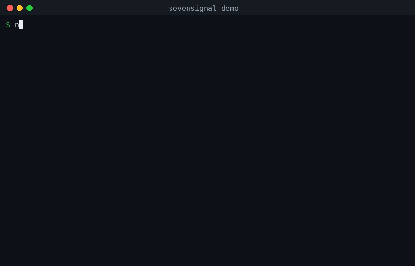

# sevensignal

Fan-built agent skills for BTS fans. English-first, with Korean summaries.

팬이 만든 BTS 팬용 에이전트 스킬 모음입니다. 영어가 기본이며 한국어 요약을 함께 제공합니다.

**Status:** v0.1.0 is released. Two skills: bts-ticket-safety (complete and
tested) and bts-official-news (new, unreleased). Community validation is next.

## Install

One command loads both skills into your agent through the
[skills CLI](https://skills.sh/) (Claude Code, Codex, Cursor, and more):

```bash
npx skills add helenanova/sevensignal
```



## What this is

A collection of open-source skills that an AI agent can load to help BTS fans with
practical, safety-critical tasks. The first skill focuses on the highest-risk moment
in fandom life: buying concert tickets without getting scammed.

The name: "seven" is a nod to the seven members. "Signal" is what the skills do -
separate trusted signals (official announcements, official sellers) from noise
(scams, rumors, resellers). The codename deliberately avoids "BTS" and "ARMY" to
keep trademark risk low.

## Design principles

1. **Official sources only.** Every trust decision anchors on a deterministic
   allowlist of official domains, not on vibes or search rankings.
2. **Deterministic over clever.** Domain matching is exact string logic that anyone
   can audit. No model judgment calls on what "looks official".
3. **Advise, never transact.** These skills help a fan decide. They never buy
   tickets, hold credentials, or move money.
4. **Freshness is a feature.** Tour dates, onsale times, and prices go stale. Claims
   that expire are marked for re-verification, with the official place to check.
5. **Refusal is a valid answer.** Out-of-scope requests get a clear refusal plus a
   safe redirect, not a half-answer.

## Repository layout

```
sevensignal/
  LICENSE                     MIT
  README.md                   this file
  DISCLAIMER.md               unofficial-project and no-affiliation notice
  SECURITY.md                 how to report security and trust problems
  CONTRIBUTING.md             content and evidence rules for contributors
  CODE_OF_CONDUCT.md          contributor covenant
  CHANGELOG.md                release history
  MAINTAINERS.md              the weekly maintenance loop and unmaintained policy
  docs/                       demo GIF and social preview image (no product code)
  .github/                    issue forms, pull request template, CI workflows
  tools/                      executable checks (matcher, validators, eval runner)
  skills/
    bts-ticket-safety/
      SKILL.md                the skill definition (English + full Korean guidance)
      data/
        official-domains.yaml deterministic allowlist of official domains
      references/
        scam-patterns.md      catalog of known ticket-scam patterns
        official-channels.md  where official announcements actually appear
      evals/
        README.md             eval schema and how to run them
        golden.yaml           legitimate scenarios -> expected trust verdicts
        adversarial.yaml      scam scenarios -> expected scam verdicts
        refusal.yaml          out-of-scope asks -> expected refusals
        freshness.yaml        claims that expire -> re-verification rules
    bts-official-news/
      SKILL.md                official tour/news tracking, public pages only
      evals/                  golden, adversarial, refusal, freshness suites
```

## Verify the trust data locally

The domain-matching rules are executable, and the trust data carries its own
checks:

```bash
python3 tools/test_domain_matcher.py   # unit tests (no dependencies)
python3 tools/validate_data.py         # schema + 30-day staleness check
python3 tools/eval_runner.py           # deterministic eval assertions
python3 tools/check_links.py           # live source-link check
```

See `tools/README.md` for details. CI runs the first three on every change;
a weekly workflow re-checks data freshness and source links and opens one
`stale-data` issue when anything needs re-verification.

한국어 요약: 위 명령으로 도메인 일치 규칙과 신뢰 데이터를 직접 검증할 수
있습니다. 데이터가 30일 이상 오래되면 자동으로 경고가 열립니다.

## Roadmap (not built yet)

- Fan community safety (Discord/X impersonation detection) - deliberately
  deferred: impersonation judgment carries real defamation risk and needs
  more design before it ships as a deterministic skill.
- v0.2.0 after community validation: soft-launch feedback triaged, field
  reports turned into fixtures, all `last_verified` dates re-checked.

## License

MIT. Home: https://github.com/helenanova/sevensignal
